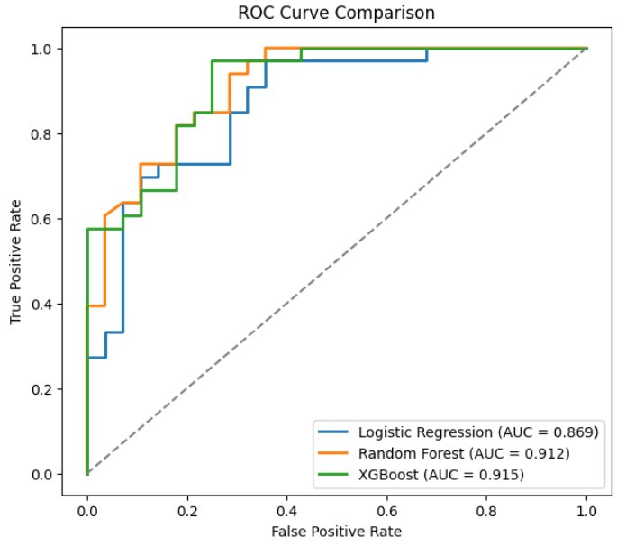
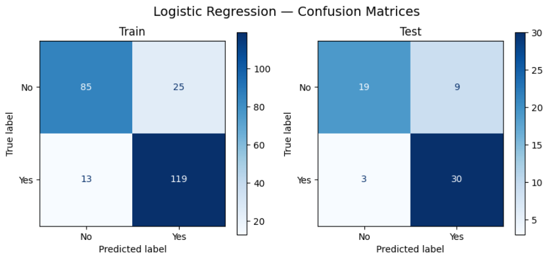
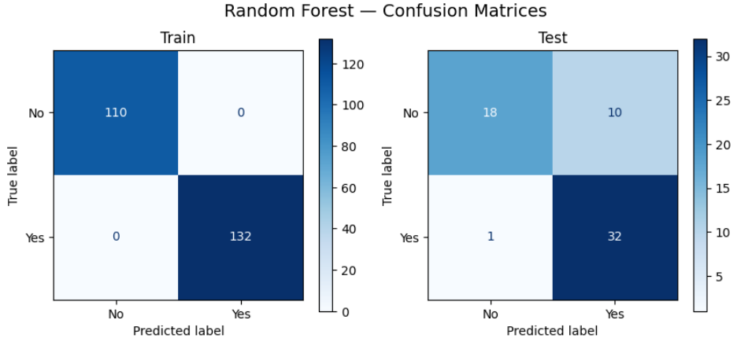
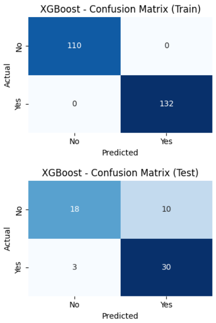

# CardioAI
CardioAI is a machine learning-based heart disease prediction system that uses clinical patient data and multiple classification algorithms to predict cardiovascular disease risk.
The project focuses on comparing machine learning models, evaluating performance metrics, and visualizing prediction accuracy using ROC curves and confusion matrices.

## Features
- Heart disease prediction using ML
- Data preprocessing and feature scaling
- Model comparison and evaluation
- Hyperparameter tuning
- ROC curve visualization
- Confusion matrix analysis
- Classification report generation

## Models Used
- Logistic Regression
- Random Forest
- XGBoost

## Libraries
- Pandas
- NumPy
- Scikit-learn
- XGBoost
- Matplotlib

## Machine Learning Workflow
1. Dataset preprocessing
2. Feature scaling using StandardScaler
3. Train-test split
4. Model training
5. Hyperparameter tuning
6. Performance evaluation
7. Visualization of results

## Results
- Achieved strong classification performance using ensemble learning models
- Compared multiple ML algorithms for prediction accuracy
- Evaluated models using ROC-AUC, confusion matrix, precision, recall, and F1-score
- XGBoost and Random Forest demonstrated high predictive capability on cardiovascular datasets

# Project Screenshots

## ROC Curve Comparison

The ROC curve compares the classification performance of different machine learning models using AUC scores.

---

## Logistic Regression Confusion Matrix

Visualization of prediction accuracy and classification errors for Logistic Regression.

---

## Random Forest Confusion Matrix

Confusion matrix generated for the Random Forest classifier.

---

## XGBoost Confusion Matrix

Performance visualization for the XGBoost classification model.

## Author
Vidyuth Baraneetharan

